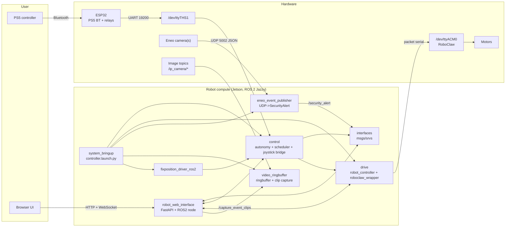
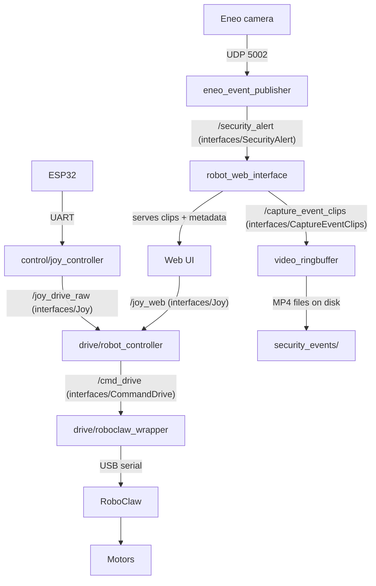

# Tactical Mower

Complete software stack for a **two-wheeled robotic surveillance / inspection platform** built on **ROS 2 Jazzy**, targeting a **Jetson Orin Nano**.

This repo contains:

- **ROS 2 workspace** (`ros2_ws/`) with multiple packages (control, drive, bringup, events, video, interfaces, Fixposition driver)
- **Web UI + API** (`robot_web_interface` package) serving the frontend from `static/`
- **ESP32 firmware** (`arduino/PS5_ESP32`) for PS5 controller bridging + relay control
- **Docker deployment** (Jetson runtime + web container)
- **Hardware test scripts** (`test_scripts/`)

> If you cloned without submodules (Fixposition SDK is a submodule), run:
>
> `git submodule update --init --recursive`

---

## System purpose
The robot is designed for **remote optical surveilance**. Manual driving is done via a **PS5 controller → ESP32 (Bluetooth) → UART → Jetson**. The Jetson runs the ROS2 stack (manual driving, autonomy, scheduling, security/events, video capture, and the web UI). Motor actuation is handled by a **RoboClaw** motor controller over USB.

---

## Architecture (high level)

### System overview



### Data flow (topics/services that tie packages together)



---

## Repository structure

Top-level folders/files you typically touch:

```text
arduino/                 ESP32 firmware (PS5 controller + relays)
docker/                  Dockerfiles (Jetson ROS2 + Web)
docker-compose.yaml      Main deployment compose (ros2_jetson + web_app)
fastdds.xml              FastDDS profile used by the web container
media/                   Assets (logo, etc.)
ros2_ws/                 ROS2 workspace (packages live in ros2_ws/src/)
static/                  Frontend (HTML/CSS/JS) served by robot_web_interface
test_scripts/            Standalone hardware/debug scripts (UART, etc.)
autostart_drive.sh       Optional helper to start bringup in an existing container
```

---

## ROS 2 packages (index)

> These READMEs are the authoritative docs for interfaces, parameters, and “how to run” each subsystem.

- **Bringup / orchestration**
  - `ros2_ws/src/system_bringup/README.md` (start everything): `ros2 launch system_bringup controller.launch.py`
- **Drive stack**
  - `ros2_ws/src/drive/README.md` (manual driving, RoboClaw, battery)
- **System interfaces**
  - `ros2_ws/src/interfaces/README.md` (messages/services shared across packages)
- **Security/events**
  - `ros2_ws/src/eneo_event_publisher/README.md` (UDP camera events → `/security_alert`)
- **Video capture**
  - `ros2_ws/src/video_ringbuffer/README.md` (frame ringbuffers + `/capture_event_clips` service)
- **Control / autonomy / scheduling**
  - `ros2_ws/src/control/README.md` (main documentation; the code lives in `ros2_ws/src/control/control/`)
- **Web UI + API (FastAPI + ROS2)**
  - `ros2_ws/src/robot_web_interface/` (README to be added; entrypoint is `robot_web_interface/main.py`)
- **Localization (external)**
  - `ros2_ws/src/fixposition/README.md` (Fixposition driver family + SDK)

---

## Hardware summary

### Compute + comms

- **Jetson Orin Nano** (target device; stack tested here)
- **ESP32** for PS5 controller (Bluetooth) + relay outputs
- **Router (4G/5G)** for remote access

### Motor + actuation

- **RoboClaw motor controller** (USB serial)
- **Differential drive** (two wheel motors)

### Power

- **Main power (motors + RoboClaw + modem)**: 24–30V
- **Jetson**: 12V
- **Thermal Camera**: 12V
- **ESP32 + relay control**: 5V

### Device links (current defaults)

- **ESP32 → Jetson UART**: `/dev/ttyTHS1`, **19200 baud**
- **RoboClaw → Jetson USB**: `/dev/ttyACM0`, **115200 baud**, address `[128]`

---

## Deployment (Jetson via Docker)

### Prerequisites

- JetPack 6+
- Docker + Docker Compose
- UART + USB devices available on the host:

```bash
ls -l /dev/ttyTHS1
ls -l /dev/ttyACM0
```

### Build

From the repo root:

```bash
docker-compose build
```

### Run

```bash
docker-compose up
```

What starts (see `docker-compose.yaml`):

- **`ros2_jetson`**: builds `docker/Dockerfile.ros2_jetson`, builds the ROS2 workspace, runs `ros2 launch system_bringup controller.launch.py`
- **`web_app`**: builds `docker/Dockerfile.web`, builds the “web” ROS2 overlay, runs `robot_web_interface` (FastAPI on port **8020**)

Notes:

- Uses **`network_mode: host`** for DDS discovery.
- The web container uses `FASTRTPS_DEFAULT_PROFILES_FILE=/tmp/fastdds.xml` (copied from `fastdds.xml`).
- A host routes/data folder is expected at `../routen` and is mounted into containers.

---

## Development workflow (common)

### Rebuild inside a running container

```bash
docker exec -it ros2_jetson bash
cd /app/ros2_ws
colcon build --symlink-install --build-base build_ros2 --install-base install_ros2
source install_ros2/setup.bash
```

### Run the bringup launch manually (inside container)

```bash
ros2 launch system_bringup controller.launch.py
```

---

## Troubleshooting (quick)

### No joystick data (ESP32 → Jetson)

- Confirm ESP32 is powered (5V) and paired to the controller
- Confirm `/dev/ttyTHS1` exists and is mapped into the container
- Check raw UART data (host):

```bash
python3 test_scripts/uart_read.py
```

### RoboClaw not responding / no motion

- Check `/dev/ttyACM0` exists and is mapped into the container
- Ensure main power (24–30V) is present
- Confirm RoboClaw address is `128` (and matches `drive/config/params.yaml`)

### Web UI can’t talk to ROS2

- Confirm both containers share the same `ROS_DOMAIN_ID`
- Host networking is required for DDS discovery (`network_mode: host` is already set)
- Check logs:

```bash
docker logs web_app
```

---

## Contributing / notes

- ROS2 packages live in `ros2_ws/src/`.
- Frontend files are served from `static/` by `robot_web_interface`.
- When changing custom messages/services, rebuild the workspace (at least the `interfaces` package) and re-source the overlay.
