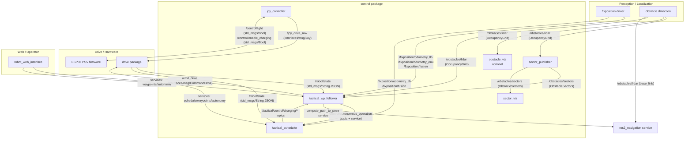

## `control` (ROS 2 package)

Robot **autonomy and orchestration** for the tactical mower:

- **Navigation / waypoint following** (traditional algorithm or optional Nav2)
- **Obstacle avoidance** (sector-based state machine)
- **Mission + schedule execution** (time windows, routes, charging logic)
- **Robot operational state machine** (manual ↔ autonomous, docking/charging, recovery)
- **Joystick UART bridge** (ESP32 → ROS 2 `interfaces/msg/Joy`)

This package is primarily **Python** (`ament_python`). It exposes multiple ROS 2 nodes via console scripts (see below).

---

## Architecture

### High-level component diagram



### Core design split

- **`tactical_wp_follower`**: “robot loop” (state machine + control loop) that ultimately outputs `/cmd_drive`.
- **`tactical_scheduler`**: “mission manager” that owns schedule persistence and exposes services (the follower queries what to do next).

This split keeps motion generation and scheduling decisions decoupled, while still allowing tight coordination for docking/charging flows.

---

## TF (Transform) Tree

The robot's coordinate frame hierarchy is defined by the following TF tree:

```
map
  └── odom
       └── vrtk_link
            ├── base_link
            ├── base_footprint
            └── lidar_link
```

### Transform Details

| Transform | Published By | Type | Description |
|-----------|--------------|------|-------------|
| `map → odom` | `fixposition_driver_node` (Fixposition Driver) | Dynamic | Global positioning frame to odometry frame. Computed from ENU0 → POI transform. |
| `odom → vrtk_link` | `fixposition_driver_node` (Fixposition Driver) | Dynamic | Odometry frame to VRTK (GNSS/IMU) sensor frame. Computed from ENU0 → POISH transform. |
| `vrtk_link → base_link` | `TransformManager` (in `tactical_wp_follower_node`) | Static | VRTK sensor to robot base center. Configurable via `transforms.vrtk_to_base.(x|y|z)` parameters (default: x=0.18m, y=0.0m, z=0.45m). |
| `vrtk_link → base_footprint` | `TransformManager` (in `tactical_wp_follower_node`) | Static | VRTK sensor to robot base footprint (ground projection, z=0). Used for 2D navigation (ros2_navigation). Configurable via `transforms.vrtk_to_base_footprint.(x|y|z)` parameters (default: x=0.18m, y=0.0m, z=0.0m). |
| `base_link → lidar_link` | `TransformManager` (in `tactical_wp_follower_node`) | Static | Robot base to LiDAR sensor frame. Configurable via `transforms.base_to_lidar.(x|y|z)` parameters (default: x=0.2m, y=0.0m, z=0.6m). |

### Frame Descriptions

- **`map`**: Global fixed frame (aligned with ENU0 from Fixposition Driver)
- **`odom`**: Odometry frame (drifts over time, but continuous)
- **`vrtk_link`**: VRTK (GNSS/IMU) sensor frame (from Fixposition Driver)
- **`base_link`**: Robot base center frame (physical center of robot, ~45cm above ground)
- **`base_footprint`**: Robot base footprint frame (projection of `base_link` onto ground, z=0, for 2D navigation)
- **`lidar_link`**: LiDAR sensor frame (Livox MID-360)

### Configuration

Static transforms are configured in `config/params.yaml` under `tactical_wp_follower.transforms.*`:

```yaml
tactical_wp_follower:
  ros__parameters:
    tf_timeout: 1.0  # [s] Timeout for TF lookups
    transforms:
      vrtk_to_base:
        x: 0.18  # [m] Offset from vrtk_link to base_link
        y: 0.0
        z: 0.45
      vrtk_to_base_footprint:
        x: 0.18  # [m] Offset from vrtk_link to base_footprint
        y: 0.0
        z: 0.0   # base_footprint is on ground (z=0)
      base_to_lidar:
        x: 0.2   # [m] Offset from base_link to lidar_link
        y: 0.0
        z: 0.6   # Default lidar height
```

All static transforms are published by `TransformManager` within `tactical_wp_follower_node` once during initialization. ROS2 transient_local QoS on `/tf_static` ensures that late-joining nodes receive these transforms automatically.

### TF Handling Best Practices

1. **Robot Pose Queries**: Use TF-based pose queries (`TransformManager.get_robot_pose_tf()`) instead of GPS-based calculations when possible. The system automatically falls back to GPS if TF is unavailable.

2. **Static Transforms**: Static transforms are published once - no periodic republishing needed. ROS2 transient_local QoS handles late-joining nodes.

3. **Frame Conventions**: Always use the correct frame IDs:
   - Waypoints should be in `map` frame
   - Robot pose queries use `base_footprint` for 2D navigation
   - Sensor data should specify correct frame IDs in headers

4. **TF Timeout**: Configure `tf_timeout` parameter (default: 1.0s) based on your system's TF update rate. Longer timeouts may be needed if TF updates are infrequent.

5. **Validation**: Use `validate_gps_to_map_with_tf()` to detect discrepancies between GPS and TF systems during development/debugging.

### TF Troubleshooting

**Problem: Robot pose queries return None**
- Check that TF tree is complete: `ros2 run tf2_ros tf2_echo map base_footprint`
- Verify Fixposition Driver is running and publishing `map → odom` and `odom → vrtk_link`
- Check TF timeout parameter - may need to increase if TF updates are slow
- System will fall back to GPS-based calculation if TF fails

**Problem: Waypoints not working correctly**
- Verify waypoints are in `map` frame (check `header.frame_id`)
- Frame validation warnings will be logged if waypoints use wrong frames
- Ensure TF tree is complete before setting waypoints

**Problem: Static transforms not visible to late-joining nodes**
- This should not happen with ROS2 transient_local QoS
- Verify `TransformManager.publish_static_transforms()` was called
- Check `/tf_static` topic: `ros2 topic echo /tf_static`

**Problem: TF lookup timeouts**
- Increase `tf_timeout` parameter in `params.yaml`
- Check that all required transforms are being published
- Verify network/system performance if using distributed setup

---

## Dependencies

### ROS 2 dependencies (from `package.xml`)

- **Runtime**: `rclpy`, `std_msgs`, `sensor_msgs`, `geometry_msgs`, `nav_msgs`
- **Interfaces**: uses custom types from the workspace `interfaces` package (messages/services)

> Note: `control/package.xml` currently lists `osr_interfaces`, but the code imports `interfaces.*`. If you hit build issues, align that dependency name with the actual interface package in this repo.

### Python / system dependencies (imported by code)

- **Config & time**: `pyyaml`, `pytz`
- **UART**: `pyserial` (for `joy_controller`)
- **Visualization**: `numpy`, `opencv-python` (for `obstacle_viz`)
- **TF**: `tf2_ros`, `tf2_geometry_msgs` (for coordinate transformations)
- **Navigation (optional)**: `ros2_navigation` service (used by `WaypointFollowerNav2`)

---

## Nodes / executables

The package installs these entrypoints (see `setup.py` `console_scripts`):

### 1) `joy_controller` (`control.joy_controller_node`)

**Purpose**: Read PS5 controller values from ESP32 over UART and publish `interfaces/msg/Joy`.

- **Publishes**
  - **`/joy_drive_raw`** (`interfaces/msg/Joy`) — default, configurable
- **Subscribes**
  - **`/control/light`** (`std_msgs/Bool`) — forwarded to ESP32 over UART
  - **`/control/enable_charging`** (`std_msgs/Bool`) — forwarded to ESP32 over UART
- **Key parameters** (from `config/params.yaml`)
  - **`port`** (default `/dev/ttyTHS1`)
  - **`baudrate`** (default `19200`)
  - **`topic_output`** (default `/joy_drive_raw`)
  - **`topic_light_control`** (default `/control/light`)
  - **`topic_charging_control`** (default `/control/enable_charging`)

> Note: `control.launch.py` currently launches `joy_controller` **without** a params file. If you want to apply `config/params.yaml`, run it like:
>
> ```bash
> ros2 run control joy_controller --ros-args --params-file $(ros2 pkg prefix control)/share/control/config/params.yaml
> ```

### 2) `tactical_wp_follower` (`control.nodes.tactical_wp_follower_node`)

**Purpose**: Main autonomy loop. Converts high-level goals (waypoints / schedules) into low-level drive commands. Handles:

- Waypoint following (traditional or Nav2-backed)
- Obstacle avoidance (sector-based)
- Docking/undocking and charging orchestration via a robot state machine
- Safety checks (e.g., RTK status monitoring hooks)

- **Publishes**
  - **`/cmd_drive`** (`interfaces/msg/CommandDrive`) — low-level drive command
  - **`/tactical/robot/route_completed`** (`std_msgs/Bool`)
  - **`/tactical/robot/charging_status`** (`std_msgs/String`)
  - **`/control/autonomous_operation`** (`std_msgs/Bool`) — current autonomous mode state
  - **`/tactical/robot/speed_kmh`** (`std_msgs/Float32`)
  - **`/tactical/robot/state`** (`std_msgs/String`) — robot state machine state as a string
  - **`/tactical/logging/warn`** (`std_msgs/String`) — warnings intended for the web UI
  - **`/tactical/control/charging/requested`** (`std_msgs/Bool`) — “charging requested” flag (also subscribed)
- **Subscribes**
  - **`/robot/state`** (`std_msgs/String`) — JSON payload used as a “unified” state input (charging state, etc.)
  - **`/fixposition/odometry_llh`** (`sensor_msgs/NavSatFix`)
  - **`/fixposition/odometry_enu`** (`nav_msgs/Odometry`)
  - **`/fixposition/fusion`** (`fixposition_driver_msgs/msg/FusionEpoch`)
  - **`/tactical/control/charging/dock`** (`geometry_msgs/Point`)
  - **`/tactical/control/charging/undock`** (`std_msgs/Bool`)
  - **`/tactical/control/charging/requested`** (`std_msgs/Bool`)
  - **`/control/set_speed`** (`std_msgs/Float32`)
  - **`/control/obstacle_avoidance_enabled`** (`std_msgs/Bool`)
  - **`/control/enable_charging`** (`std_msgs/Bool`)
  - **`/obstacle_detected`** (`std_msgs/Bool`)
  - **`/obstacles/lidar`** (`nav_msgs/OccupancyGrid`)
  - **`/obstacles/sectors`** (`interfaces/msg/ObstacleSectors`)
- **Provides services**
  - **`/control/autonomous_operation`** (`interfaces/srv/CommandControl`)
  - **`/control/waypoints`** (`interfaces/srv/WaypointService`)
- **Calls services**
  - **`/control/get_schedule_action`** (`interfaces/srv/GetScheduleAction`) — provided by `tactical_scheduler`
- **Key parameters** (from `config/params.yaml`)
  - **`settings_file`** (default `/routen/settings/settings.yaml`)
  - **`routes_dir`** (default `/routen/routes`)
  - **`control_frequency`** (default `10.0`)
  - **`max_steering`** (default `100.0`)
  - **`transforms.*`** static transform offsets:
    - `transforms.vrtk_to_base.(x|y|z)`
    - `transforms.base_to_lidar.(x|y|z)`
  - **Obstacle avoidance tuning**:
    - `obstacle_avoidance.speed_reduction_slow`

### 3) `tactical_scheduler` (`control.nodes.tactical_scheduler_node`)

**Purpose**: Persist and evaluate schedules, then coordinate “what mission should run now?” including charging/home-return decisions.

Design note in code: **scheduler provides data; the control loop makes decisions**. Concretely, the scheduler exposes `GetScheduleAction` that the follower can query, rather than continuously publishing a route topic.

- **Publishes**
  - **`/tactical/control/schedule/acknowledge`** (`std_msgs/Bool`)
  - **`/tactical/control/charging/dock`** (`geometry_msgs/Point`)
  - **`/tactical/control/charging/undock`** (`std_msgs/Bool`)
  - **`/control/enable_charging`** (`std_msgs/Bool`)
  - **`/tactical/control/charging/requested`** (`std_msgs/Bool`)
  - **`/tactical/logging/info`** (`std_msgs/String`)
  - **`/tactical/logging/warn`** (`std_msgs/String`)
  - **`/tactical/logging/error`** (`std_msgs/String`)
- **Subscribes**
  - **`/robot/state`** (`std_msgs/String`) — JSON payload (battery, charging, etc.)
  - **`/fixposition/odometry_llh`** (`sensor_msgs/NavSatFix`)
  - **`/tactical/robot/route_completed`** (`std_msgs/Bool`)
  - **`/tactical/robot/charging_status`** (`std_msgs/String`)
  - **`/fixposition/fusion`** (`fixposition_driver_msgs/msg/FusionEpoch`)
  - **`/control/autonomous_operation`** (`std_msgs/Bool`)
  - **`/tactical/robot/state`** (`std_msgs/String`) — robot state machine status
- **Provides services**
  - **`/tactical/control/schedule`** (`interfaces/srv/ScheduleService`)
  - **`/control/get_schedule_action`** (`interfaces/srv/GetScheduleAction`)
  - **`/control/go_to_charge_pos_and_charge`** (`interfaces/srv/CommandControl`)
  - **`/control/charge_manual`** (`interfaces/srv/CommandControl`)
- **Key parameters** (from `config/params.yaml`)
  - **`schedules_file`** (default `/routen/settings/schedules.yaml`)
  - **`routes_dir`** (default `/routen/routes`)
  - **`settings_file`** (default `/routen/settings/settings.yaml`)
  - **`check_interval`** (default `2.0`)
  - **`default_tolerance_home_check`** (default `0.5` in YAML)

> Note: `control.launch.py` currently launches `tactical_scheduler` **without** a params file. If you want to apply `config/params.yaml`, run it like:
>
> ```bash
> ros2 run control tactical_scheduler --ros-args --params-file $(ros2 pkg prefix control)/share/control/config/params.yaml
> ```

### 4) `sector_publisher` (`control.obstacle_avoidance.sector_analysis.sector_publisher_node`)

**Purpose**: Convert an `OccupancyGrid` into a compact **sector summary** (`interfaces/msg/ObstacleSectors`) used by avoidance logic.

- **Subscribes**
  - **`/obstacles/lidar`** (`nav_msgs/OccupancyGrid`) — configurable
- **Publishes**
  - **`/obstacles/sectors`** (`interfaces/msg/ObstacleSectors`) — configurable
- **Key parameters** (from `config/params.yaml`)
  - `sector_analysis.max_range` (default `5.0`)
  - `sector_analysis.config_path` (default `""` = auto-detect `config/sector_config.yaml` from package share)
  - `topics.obstacles_input` (default `/obstacles/lidar`)
  - `topics.sectors_output` (default `/obstacles/sectors`)

### 5) `sector_viz` (`control.obstacle_avoidance.sector_analysis.sector_viz_node`)

**Purpose**: Publish RViz visualization markers (`visualization_msgs/MarkerArray`) for obstacle sectors. Shows sector boxes with color coding (red for STOP, yellow/orange for SLOW) and opacity based on blocked status.

- **Subscribes**
  - **`/obstacles/sectors`** (`interfaces/msg/ObstacleSectors`) — configurable
- **Publishes**
  - **`/obstacles/sectors_viz`** (`visualization_msgs/MarkerArray`) — configurable, for RViz visualization
- **Key parameters** (from `config/params.yaml`)
  - `sector_analysis.config_path` (default `""` = auto-detect `config/sector_config.yaml` from package share)
  - `topics.sectors_input` (default `/obstacles/sectors`)
  - `topics.markers_output` (default `/obstacles/sectors_viz`)
  - `viz.frame_id` (default `base_link`)
  - `viz.height` (default `0.1` meters)
  - `viz.alpha_blocked` (default `0.7` opacity when blocked)
  - `viz.alpha_free` (default `0.2` opacity when free)

### 6) `obstacle_viz` (`control.obstacle_avoidance.obstacle_viz_node`)

**Purpose**: Publish a top-down visualization image of obstacles + sectors for debugging. **Note**: This node is optional and not launched by default in `control.launch.py` (commented out). Enable it manually if needed for debugging.

- **Subscribes**
  - **`/obstacles/lidar`** (`nav_msgs/OccupancyGrid`)
- **Publishes**
  - **`/obstacles/image`** (`sensor_msgs/Image`) — configurable
- **Key parameters** (from `config/params.yaml`)
  - Robot footprint: `robot.footprint.(width|front|rear)`
  - Viz: `viz.(range_m|resolution_m_per_px|upsample_factor|image_topic)`
  - Sector analysis: `sector_analysis.(max_range|config_path)`
  - Topics: `topics.obstacles_input`

---

## Interfaces (topics & services)

This section highlights the “public API” other packages integrate with. For full message/service definitions, see the workspace `interfaces` package README and `ros2 interface show ...`.

### Core topics

- **`/cmd_drive`** (`interfaces/msg/CommandDrive`): autonomy → drive actuation
- **`/joy_drive_raw`** (`interfaces/msg/Joy`): joystick → drive controller
- **`/control/autonomous_operation`**:
  - **Topic**: (`std_msgs/Bool`) state broadcast
  - **Service**: (`interfaces/srv/CommandControl`) state change request
- **`/obstacles/lidar`** (`nav_msgs/OccupancyGrid`): obstacle grid input
- **`/obstacles/sectors`** (`interfaces/msg/ObstacleSectors`): sector summary used for avoidance
- **`/robot/state`** (`std_msgs/String` JSON): coarse “unified” robot status (battery/charging/etc.)

### Core services

- **`/control/waypoints`** (`interfaces/srv/WaypointService`): replace/set current waypoint list
- **`/tactical/control/schedule`** (`interfaces/srv/ScheduleService`): add/update/remove schedules
- **`/control/get_schedule_action`** (`interfaces/srv/GetScheduleAction`): scheduler → follower “next action” query
- **`/control/go_to_charge_pos_and_charge`** (`interfaces/srv/CommandControl`): request charging workflow
- **`/control/charge_manual`** (`interfaces/srv/CommandControl`): manual charging control

---

## Configuration

### Package-shipped config

- **`config/params.yaml`**: default parameters for the nodes launched by `control.launch.py`
- **`config/sector_config.yaml`**: rectangular sector definitions used by `sector_publisher` / `obstacle_viz`

### Runtime “data” files (typically volume-mounted)

These are referenced by parameters and expected to exist at runtime:

- **Settings**: `/routen/settings/settings.yaml`
  - home point / charge point
  - speed factor, waypoint tolerance, battery thresholds, etc.
- **Schedules**: `/routen/settings/schedules.yaml`
- **Routes**: `/routen/routes/*.yaml`

The code also tries fallback directories to avoid container/host path mismatches:
`/routen/routes` and `/data/routes`.

---

## Build & installation

From the ROS 2 workspace root (`ros2_ws/`):

```bash
colcon build --packages-select control
source install/setup.bash
```

If you’re building in a container/Jetson image, ensure the Python dependencies used by nodes (e.g., `pyserial`, `pytz`, `opencv`, `numpy`) are present.

---

## Usage

### Launch (recommended)

```bash
ros2 launch control control.launch.py
```

Useful launch args:

```bash
# Increase logging verbosity
ros2 launch control control.launch.py log_level:=debug
```

### Run individual nodes

```bash
ros2 run control joy_controller
ros2 run control tactical_wp_follower
ros2 run control tactical_scheduler
ros2 run control sector_publisher
ros2 run control sector_viz
ros2 run control obstacle_viz  # Optional: not launched by default
```

### Quick introspection

```bash
ros2 node list
ros2 topic list
ros2 service list

ros2 param list /tactical_wp_follower
ros2 param list /tactical_scheduler
```

---

## Testing

This package currently ships **style/lint tests** (`ament_flake8`, `ament_pep257`, etc.):

```bash
colcon test --packages-select control
colcon test-result --verbose
```

---

## Development notes

### Code structure

- **`control/nodes/`**: top-level ROS nodes (`tactical_wp_follower_node.py`, `tactical_scheduler_node.py`)
- **`control/robot_state_machine/`**: robot operational state machine (State pattern; states in `states/`)
- **`control/obstacle_avoidance/`**: avoidance controller + state machine + sector analysis + visualization
- **`control/navigation/`**: waypoint follower implementations and TF/GPS helpers (optional Nav2 adapter under `navigation/nav2/`)
- **`control/scheduling/`**: schedule persistence + validation
- **`control/routes/`**: route loading and conversions

### Conventions used in this repo

- **Geo coordinates**: `geometry_msgs/Point` is used as `(x=lat, y=lon, z=alt)` in `interfaces/msg/GeoPath` and related services.
- **Autonomy enable**: `/control/autonomous_operation` exists as both a **topic** (`std_msgs/Bool`) and a **service** (`interfaces/srv/CommandControl`).

---

## Troubleshooting

- **Joy controller can’t open UART**
  - Check `joy_controller.port` (default `/dev/ttyTHS1`) and permissions.
  - Confirm baud rate matches ESP32 firmware (`19200` by default).

- **Nav2 mode doesn't move**
  - Ensure `ros2_navigation` package is available and `nav2_navigation_node` is running.
  - Check that `/obstacles/lidar` is being published (required by `ros2_navigation`).
  - Verify TF tree is complete: `ros2 run tf2_ros tf2_echo odom base_footprint`

- **No obstacle sectors**
  - Ensure `/obstacles/lidar` is being published.
  - Confirm `sector_publisher` is running and `config/sector_config.yaml` is found (or set `sector_analysis.config_path` explicitly).

- **Schedules/routes not found**
  - Verify the mounted paths exist:
    - `/routen/settings/settings.yaml`
    - `/routen/settings/schedules.yaml`
    - `/routen/routes/*.yaml`
  - In containerized setups, check volume mounts to `/routen` or `/data`.

