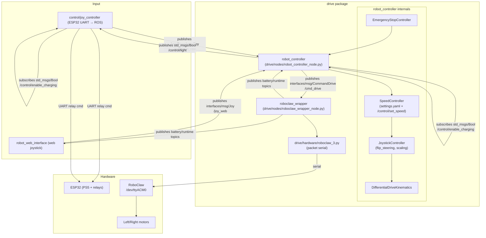

# Drive Package (ROS 2) — `drive`

The `drive` package is the mower’s **low-level drive stack**: it turns joystick-like inputs into left/right wheel commands, sends them to the motor controller, and publishes battery/runtime telemetry for the UI.

- **Primary nodes**
  - **`robot_controller`**: joystick arbitration + differential-drive kinematics + “control facade” services for UI buttons (light/alarm/siren/e-stop) + `/robot/state` JSON snapshot.
  - **`roboclaw_wrapper`**: encoderless RoboClaw motor output + battery SOC + runtime estimate.
- **What this package does _not_ do**
  - It does **not** talk to the PS5 controller directly (that’s `control/joy_controller` + ESP32).
  - It does **not** run high-level autonomy / waypoint following (that’s in `control`).

> The ESP32 UART bridge (`control/joy_controller`) is the component that publishes `/joy_drive_raw` and forwards relay topics (`/control/light`, `/control/enable_charging`) to the ESP32.

---

## Architecture



---

## Package dependencies

- **ROS 2**: `rclpy`, `std_msgs`, `geometry_msgs`
- **Internal interfaces**: `interfaces`
  - `interfaces/msg`: `Joy`, `CommandDrive`, `GeoPath`
  - `interfaces/srv`: `CommandControl`
- **Hardware**
  - RoboClaw driver: `drive/hardware/roboclaw_3.py`
- **Optional runtime coupling**
  - `control.navigation.geo_helper.calculate_route_distance_from_waypoints()` is imported if the `control` package is present. If not, route-distance in `/robot/state` is `0.0` and a warning is logged.

---

## Nodes

This package installs two console executables (see `setup.py`):

- **`robot_controller`** → `drive.nodes.robot_controller_node:main`
- **`roboclaw_wrapper`** → `drive.nodes.roboclaw_wrapper_node:main`

### `robot_controller` (node name: `robot_controller`)

**Responsibilities**

- **Joystick arbitration**: gamepad (`/joy_drive_raw`) wins; web joystick (`/joy_web`) is applied only after a short inactivity timeout.
- **Differential-drive kinematics**: convert `(steer, speed)` into wheel angular velocities in **rad/s**.
- **Safety interlocks**:
  - **Emergency stop** via `/control/emergency_stop` service forces commands to **0**.
  - **Charging interlock**: when `/control/enable_charging` is `True`, manual driving is blocked.
- **UI-facing “control facade”**: exposes `/control/*` services, publishes `/robot/state` JSON, and publishes a Bool on `/control/light` to be forwarded to the ESP32.

**Subscriptions**

- **Joystick**
  - `/joy_drive_raw` (`interfaces/msg/Joy`) — gamepad / ESP32 bridge (priority)
  - `/joy_web` (`interfaces/msg/Joy`) — web UI joystick
- **State inputs**
  - `/fixposition/odometry_llh` (`sensor_msgs/msg/NavSatFix`)
  - `/drive/battery_percentage` (`std_msgs/msg/Float32`)
  - `/drive/runtime_estimate` (`std_msgs/msg/Float32`) — seconds, or `-1.0` if unavailable
  - `/geopath` (`interfaces/msg/GeoPath`) — active route waypoints/mode
  - `/tactical/robot/state` (`std_msgs/msg/String`) — JSON state; used to extract active route details if present
- **Control topics**
  - `/control/set_speed` (`std_msgs/msg/Float32`) — runtime max-speed override in **m/s**
  - `/control/enable_charging` (`std_msgs/msg/Bool`) — charging relay state (also gates manual driving)
  - `/control/autonomous_operation` (`std_msgs/msg/Bool`) — for state reporting

**Publishers**

- `/cmd_drive` (`interfaces/msg/CommandDrive`) — wheel angular velocities in **rad/s**
- `/robot/state` (`std_msgs/msg/String`) — JSON state snapshot consumed by the web UI
- `/fixposition/speed` (`fixposition_driver_msgs/msg/Speed`) — wheel velocities in **mm/s** (integers) for Fixposition
- `/control/light` (`std_msgs/msg/Bool`) — forwarded by `control/joy_controller` to ESP32 relays
- `/tactical/control/schedule/acknowledge` (`std_msgs/msg/Bool`) — schedule ACK hook
- `/tactical/logging/info`, `/tactical/logging/warn`, `/tactical/logging/error` (`std_msgs/msg/String`) — log stream for UI

**Services provided** (`interfaces/srv/CommandControl`)

- `/control/light`
- `/control/alarm` (state tracking only; hardware hook not implemented here)
- `/control/siren` (state tracking only; hardware hook not implemented here)
- `/control/emergency_stop`

**Parameters**

Loaded from `config/params.yaml` (via `launch/drive.launch.py`) plus code defaults:

- **Kinematics**
  - `wheel_diameter` (m, float) — default `0.535`
  - `wheel_base` (m, float) — default `0.637`
  - `flip_steering` (bool) — default `false` (repo config sets `true`)
- **Topics**
  - `topic_input` (string) — default `/joy_drive_raw`
  - `topic_web_input` (string) — default `/joy_web` (note: not present in the repo `params.yaml`, so the default is used)
  - `topic_output` (string) — default `/cmd_drive`
  - `topic_robot_state` (string) — default `/robot/state`
  - `topic_fixposition_speed` (string) — default `/fixposition/speed`
  - `topic_light_control` (string) — default `/control/light`
- **Arbitration**
  - `gamepad_timeout` (seconds, float) — default `0.5`
- **Settings**
  - `settings_file` (path, string) — default `/routen/settings/settings.yaml`
    - If present and contains `speed_factor`, it becomes the max linear speed (m/s).


---

### `roboclaw_wrapper` (node name: `roboclaw_wrapper`, launched as `roboclaw_drive`)

**Responsibilities**

- Subscribe to `/cmd_drive` and send encoderless motor commands to RoboClaw (`DutyAccel*` by default).
- Publish battery voltage, SOC estimate, and runtime estimate.

**Subscriptions**

- `/cmd_drive` (`interfaces/msg/CommandDrive`)
- `/debug/motor_voltage` (`std_msgs/msg/Float32`) — temporary override of measured voltage for testing SOC (auto-times out after ~3s)

**Publishers**

- `/drive/battery_percentage` (`std_msgs/msg/Float32`) — 0..100
- `/drive/battery_voltage_raw` (`std_msgs/msg/Float32`) — direct RoboClaw main battery voltage
- `/drive/battery_voltage_corrected` (`std_msgs/msg/Float32`) — “corrected” voltage (currently clamped, but effectively equals raw in the shipped model)
- `/drive/runtime_estimate` (`std_msgs/msg/Float32`) — seconds remaining, or `-1.0` if unavailable

**Parameters**

The repo `config/params.yaml` sets the essentials; everything else uses code defaults.

- **RoboClaw serial**
  - `device` (string) — default `/dev/ttyACM0`
  - `baud_rate` (int) — default `115200`
  - `addresses` (int[]) — default `[128]`
- **Motor output**
  - `duty_mode` (bool) — default `true` (recommended for encoderless)
  - `drive_acceleration_factor` (float) — converted into RoboClaw accel value via `int(2**15 * factor)`
  - `velocity_qpps_to_duty_factor` (int) — scale factor converting **rad/s → duty units**
  - `roboclaw_mapping.drive_left.*` / `roboclaw_mapping.drive_right.*` — address, channel (`M1`/`M2`), `flip`
- **Battery/SOC model**
  - `voltage_publish_rate` (Hz, float)
  - `battery.min_voltage`, `battery.max_voltage`, `battery.nominal_voltage`, `battery.capacity_ah`, `battery.internal_resistance`, `battery.cells`, `battery.curve_enabled`
  - `system.default_power_usage` (W, float) — non-motor baseline power for runtime estimation
  - `runtime_estimation.safety_margin`, `runtime_estimation.short_term_window`, `runtime_estimation.long_term_window`

**Notes on current implementation**

- `config/params.yaml` includes `velocity_timeout`, but the current `roboclaw_wrapper_node.py` does not implement a timeout-to-zero yet.

---

## Configuration

- **Launch**: `launch/drive.launch.py`
  - Loads `config/params.yaml`
  - Starts:
    - `robot_controller` (node name `robot_controller`)
    - `roboclaw_wrapper` (node name `roboclaw_drive`)
- **Parameters**: `config/params.yaml`
  - Robot geometry, input/output topics, and RoboClaw mapping/scaling

---

## ROS interfaces (reference)

### Topics

- **Published**
  - `/cmd_drive` (`interfaces/msg/CommandDrive`)
  - `/robot/state` (`std_msgs/msg/String`) — JSON
  - `/fixposition/speed` (`fixposition_driver_msgs/msg/Speed`)
  - `/control/light` (`std_msgs/msg/Bool`)
  - `/drive/battery_percentage` (`std_msgs/msg/Float32`)
  - `/drive/battery_voltage_raw` (`std_msgs/msg/Float32`)
  - `/drive/battery_voltage_corrected` (`std_msgs/msg/Float32`)
  - `/drive/runtime_estimate` (`std_msgs/msg/Float32`)
- **Subscribed**
  - `/joy_drive_raw` (`interfaces/msg/Joy`)
  - `/joy_web` (`interfaces/msg/Joy`)
  - `/control/set_speed` (`std_msgs/msg/Float32`)
  - `/control/enable_charging` (`std_msgs/msg/Bool`)
  - `/control/autonomous_operation` (`std_msgs/msg/Bool`)
  - `/fixposition/odometry_llh` (`sensor_msgs/msg/NavSatFix`)
  - `/geopath` (`interfaces/msg/GeoPath`)
  - `/tactical/robot/state` (`std_msgs/msg/String`)
  - `/debug/motor_voltage` (`std_msgs/msg/Float32`)

### Services (`interfaces/srv/CommandControl`)

- `/control/light`
- `/control/alarm`
- `/control/siren`
- `/control/emergency_stop`

---

## Build & run

From the ROS 2 workspace root (`ros2_ws/`):

```bash
colcon build --packages-select drive
source install/setup.bash
```

Launch:

```bash
ros2 launch drive drive.launch.py
```

Typical manual-drive stack (minimal):

- `control/joy_controller` (ESP32 UART → `/joy_drive_raw`, forwards relay topics to ESP32)
- `drive/robot_controller`
- `drive/roboclaw_wrapper`

---


## Development notes

### Code structure

- `src/drive/nodes/`
  - `robot_controller_node.py`: orchestration, arbitration, services, `/robot/state`
  - `roboclaw_wrapper_node.py`: RoboClaw output + battery/runtime publishing
- `src/drive/controllers/`
  - `joystick_controller.py`: steering inversion + joystick → wheel commands
  - `speed_controller.py`: max speed from settings + `/control/set_speed`
  - `emergency_stop_controller.py`: emergency stop state
- `src/drive/kinematics/`
  - `differential_drive.py`: differential-drive conversion and deadband
- `src/drive/hardware/`
  - `roboclaw_3.py`: RoboClaw packet-serial driver
  - `battery_calculator.py`: SOC model
  - `runtime_estimator.py`: runtime estimation windows + safety margin
  - `uart_device.py`: CRC’d UART protocol helper (currently not used by `robot_controller`)
- `src/drive/services/`
  - `light_service.py`, `charging_service.py`: UART-based helpers (currently not wired into the running node; relay control is done via ROS topics → `control/joy_controller`)

### Units & conventions

- **Joystick input** (`interfaces/msg/Joy`)
  - `left_stick_forward` and `right_stick_right` are treated as percent-like in \([-100, 100]\).
- **Max speed**
  - `SpeedController` stores max linear speed in **m/s**.
  - `DifferentialDriveKinematics.calculate_wheel_velocities()` computes:
    - \(v = (speed/100)\cdot max\_speed\) (m/s)
    - then maps \((v,\omega)\) to wheel linear speeds and finally to **rad/s** using wheel radius.
- **Motor command** (`interfaces/msg/CommandDrive`)
  - `left_vel`/`right_vel` are wheel angular velocities in **rad/s**.
- **Fixposition wheel speed**
  - published in **mm/s** as required by `fixposition_driver_msgs/msg/Speed`.

---
## Troubleshooting

- **Robot doesn’t move**
  - Verify `roboclaw_drive` is running and receives `/cmd_drive` (`ros2 topic echo /cmd_drive`).
  - Confirm RoboClaw port/permissions: `roboclaw_wrapper.device` (commonly `/dev/ttyACM0`) and membership in `dialout` / udev rules.
  - Check left/right mapping and flips in `roboclaw_mapping.*`.
- **Web joystick does nothing**
  - Web input is only applied if the gamepad has been inactive for `gamepad_timeout` seconds.
  - Confirm you publish `interfaces/msg/Joy` on `/joy_web` (not `sensor_msgs/msg/Joy`).
- **Manual driving blocked while charging**
  - This is intentional: when `/control/enable_charging=True`, `robot_controller` rejects manual joystick commands.
- **Wheels run backwards / steering inverted**
  - Fix motor direction with `roboclaw_mapping.drive_left.flip` / `.drive_right.flip`.
  - Fix “steering feels backwards” with `robot_controller.flip_steering`.
- **Light/charging relay commands don’t do anything**
  - `drive` only publishes/subscribes the relay topics; the actual UART forwarding is done by `control/joy_controller`. Ensure it’s running and configured for the correct UART port/baud.
- **Battery/runtime values look wrong**
  - Tune `battery.*` and `system.default_power_usage` (defaults assume a 7S 30Ah-ish pack).
  - Use `/debug/motor_voltage` to test UI behavior without hardware, but remember it auto-times out.
