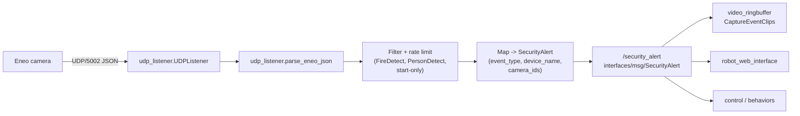

# `eneo_event_publisher`

Receives **Eneo camera UDP event notifications** and publishes them into ROS 2 as [`interfaces/msg/SecurityAlert`](../interfaces/msg/SecurityAlert.msg) on **`/security_alert`**. This is used to trigger downstream security workflows (e.g., event clip capture via `video_ringbuffer`, UI display via `robot_web_interface`, logging/behavior in `control`).

## Overview

- **Input**: UDP packets (default port **5002**) containing JSON payloads from an Eneo camera.
- **Output**: ROS 2 topic **`/security_alert`** (`interfaces/msg/SecurityAlert`)
- **Filtering**:
  - Only Eneo event types **`FireDetect`** and **`PersonDetect`** are published.
  - Optional “start-only” filtering (default enabled).
  - Rate limiting: at most **1 alert per 200 ms**.

## Architecture



## Package contents

- **Node (console script)**: `eneo_event_publisher` → `eneo_event_publisher/eneo_event_node.py`
- **Modules**:
  - `udp_listener.py`: UDP socket listener + JSON parsing (`parse_eneo_json`)
  - `eneo_event.py`: internal event container class
  - `eneo_mapping.py`: Eneo event type → `SecurityAlert.event_type` mapping
  - `eneo_parser.py`: device name mapping + (placeholder) time conversion

## ROS interfaces

### Published topics

- **`/security_alert`** (`interfaces/msg/SecurityAlert`)
  - `event_type`: derived from Eneo `EventType` via mapping
    - `FireDetect` → `"fire"`
    - `PersonDetect` → `"PD_VD"` (note: this is the current mapping in code)
  - `event_time`: currently set to “now” (receive time). The Eneo `EventTime` string is not parsed yet.
  - `device_name`: mapped by `map_device_name(DeviceName, IPAddress)`
    - If `IPAddress == "192.168.10.128"` → `"eneo_thermal"` (current hardcoded default)
    - Else: lowercased and sanitized `DeviceName` (hyphens replaced with `_`)
  - `description`: includes event type/action, device name, channels, IP
  - `camera_ids`: from `video_ringbuffer.camera_config.EVENT_RECORDING_CAMERA_IDS` (defaults to `['eneo_rgb', 'eneo_thermal']`)

### Services / actions

- None

## Parameters

Declared parameters (defaults from `eneo_event_publisher/eneo_event_node.py`):

- **`udp_port`** (int, default: `5002`): UDP port to bind on (`0.0.0.0:<udp_port>`).
- **`camera_ip`** (string, default: `"192.168.10.128"`): filter events by camera IP.
  - The filter matches the **`data.IPAddress` field inside the JSON**, not the UDP sender address.
  - To disable filtering, set to an empty string: `camera_ip:=""`.
- **`buffer_size`** (int, default: `4096`): max UDP datagram size to read.
- **`filter_start_only`** (bool, default: `True`): if true, only publish events where `EventAction == "start"`.

## UDP payload format (expected)

The listener expects a JSON payload shaped like:

```json
{
  "result": "success",
  "data": {
    "ChannelName": "Eneo-Event",
    "DeviceName": "INT-8SF0003M0A",
    "IPAddress": "192.168.10.128",
    "MacAddress": "60-27-1C-09-58-9D",
    "alarm_list": [
      {
        "EventType": "FireDetect",
        "EventTime": "2015-1-5_14:17:53",
        "EventAction": "start",
        "Chn": ["CH2"]
      }
    ]
  }
}
```

Notes:

- `alarm_list` may contain multiple alarms; each becomes one internal event and is processed independently.
- Packets that are not valid UTF-8 JSON (or do not have `"result": "success"`) are ignored.

## Build & installation

This is a standard `ament_python` package.

From the ROS 2 workspace root (`ros2_ws/`):

```bash
colcon build --packages-select eneo_event_publisher
source install/setup.bash
```

## Usage

### Run directly

```bash
ros2 run eneo_event_publisher eneo_event_publisher
```

Override parameters:

```bash
ros2 run eneo_event_publisher eneo_event_publisher --ros-args \
  -p udp_port:=5002 \
  -p camera_ip:="192.168.10.128" \
  -p filter_start_only:=true \
  -p buffer_size:=4096
```

Disable camera IP filtering (accept all cameras):

```bash
ros2 run eneo_event_publisher eneo_event_publisher --ros-args -p camera_ip:=""
```

### Run via system bringup

This node is launched as part of `system_bringup`:

- `ros2_ws/src/system_bringup/launch/controller.launch.py` creates a `Node(package='eneo_event_publisher', executable='eneo_event_publisher', ...)`

## Testing

### 1) Verify ROS output

In one terminal:

```bash
ros2 topic echo /security_alert
```

### 2) Send a synthetic UDP event (local)

Run the node, then from another terminal send a UDP packet to localhost:

```python
import json
import socket

payload = {
  "result": "success",
  "data": {
    "DeviceName": "INT-8SF0003M0A",
    "IPAddress": "192.168.10.128",
    "MacAddress": "60-27-1C-09-58-9D",
    "alarm_list": [
      {"EventType": "FireDetect", "EventTime": "2015-1-5_14:17:53", "EventAction": "start", "Chn": ["CH2"]}
    ],
  },
}

sock = socket.socket(socket.AF_INET, socket.SOCK_DGRAM)
sock.sendto(json.dumps(payload).encode("utf-8"), ("127.0.0.1", 5002))
sock.close()
```

If you keep `camera_ip` filtering enabled, ensure your synthetic payload uses the same `data.IPAddress` value as the node parameter (`camera_ip`), otherwise it will be ignored.

### 3) Listen for real camera events (no ROS)

There is also a standalone listener script:

- `test_scripts/eneo_events.py`

It prints parsed events directly from UDP port 5002 (useful for debugging camera/network issues before involving ROS).

## Troubleshooting

- **No alerts published**
  - Check the node logs: it should log `Listening on UDP port ...`.
  - Ensure UDP port **5002** is reachable on the host (firewall, Docker networking, etc.).
  - Make sure the camera is configured to send events to this host/network.
  - If `camera_ip` filtering is enabled, confirm `data.IPAddress` in the payload matches the `camera_ip` parameter exactly.
  - If `filter_start_only:=true`, “stop” events will be ignored by design.

- **Events arrive but are dropped**
  - Rate limiting is **200 ms**; bursts faster than this will be ignored.
  - Only `FireDetect` and `PersonDetect` are published; other event types are intentionally ignored.

- **`device_name` looks wrong**
  - `map_device_name()` currently hardcodes `"192.168.10.128" → "eneo_thermal"`. If you have multiple cameras or want stable naming, adjust this mapping logic.

## Development notes

- Entry point: `setup.py` registers `eneo_event_publisher = eneo_event_publisher.eneo_event_node:main`.
- If you want to support additional Eneo event types:
  - Update `ALLOWED_EVENT_TYPES` in `eneo_event_node.py`
  - Ensure the type is mapped in `eneo_mapping.py`

