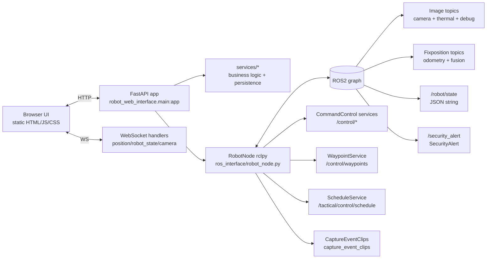

# robot_web_interface

ROS2 node + FastAPI server that exposes a web UI (HTML/JS/CSS) and a small API for:

- Manual control (move, emergency stop, light/alarm/siren, charging)
- Route CRUD + “send route” control
- Mission schedules (create/edit/toggle/delete) synced to the robot via ROS services
- Live telemetry (position, robot state, Fixposition fusion status) via WebSockets
- Live camera streams (main + thermal + debug) via WebSockets
- Security events: receive `/security_alert`, persist metadata, trigger clip capture, serve clips, optionally send email notifications

The package is built as an `ament_python` ROS2 package and runs as a single process:
**Uvicorn (FastAPI) + a ROS2 `rclpy` node spun in a background thread**.

## Architecture

### High-level components



### Repository layout (within the package)

- `src/robot_web_interface/main.py`: FastAPI app + ROS lifecycle management (creates `RobotNode`, starts ROS executor thread, mounts static files, registers routes + WS).
- `src/robot_web_interface/api/routes/*`: REST API routers (`/api/control`, `/api/routes`, `/api/schedule`, `/api/settings`, `/api/events`).
- `src/robot_web_interface/api/websockets/*`: WebSocket streams (`/ws/position`, `/ws/robot_state`, camera streams).
- `src/robot_web_interface/ros_interface/*`: ROS integration:
  - `robot_node.py`: node wiring, publishers/subscribers/service clients
  - `subscribers.py`: message callbacks (telemetry, frames, logs, security alerts)
  - `publishers.py`: service calls + publish helpers
  - `status_manager.py`: cached state for WS endpoints
- `src/robot_web_interface/services/*`: business logic and persistence:
  - routes/schedules/settings helpers
  - security event capture + storage + email notifier
- `src/robot_web_interface/utils/*`: YAML file I/O and WS connection manager.

## Dependencies

### ROS2 dependencies

Declared in `package.xml`:

- `rclpy`
- `sensor_msgs`, `std_msgs`, `geometry_msgs`
- `interfaces` (custom msgs/srvs)

Used by code (also required in the ROS environment):

- `nav_msgs`
- `cv_bridge` (for `sensor_msgs/Image` -> OpenCV)
- `fixposition_driver_msgs` (`FusionEpoch`)
- `builtin_interfaces` (`Time`, via the `CaptureEventClips` service)

### Python (web) dependencies

Installed in the web container via `requirements-web.txt`:

- `fastapi`
- `uvicorn[standard]`
- `websockets`
- `pyyaml`
- `opencv-python` (+ `numpy`)
- `pytz`

## Interfaces

### Static pages

Served as files from `/app/static` (in Docker this is baked into the image from the repo’s `static/` directory):

- `GET /` → `index.html`
- `GET /control` → `control.html`
- `GET /scheduler` → `scheduler.html`
- `GET /settings` → `settings.html`
- `GET /events` → `events.html`
- `GET /static/*` → CSS/JS assets

### WebSocket endpoints

- `GET /ws/position`
  - Sends JSON frames every ~0.5s:
    - `{ "type": "position", "data": { latitude, longitude, height, yaw } }`
    - `{ "type": "light_status", "data": <bool> }`
    - `{ "type": "autonomous_status", "data": <bool> }`
    - `{ "type": "charging_status", "data": <bool> }`
    - `{ "type": "fusion_status", "data": { ... } }`
- `GET /ws/robot_state`
  - Sends JSON frames every ~0.5s:
    - `{ "type": "robot_state", "data": { battery, velocity, error_status, ... } }`
    - `{ "type": "fusion_status", "data": { ... } }`
- Camera streams:
  - `GET /ws/camera/main` (JSON, Base64 JPEG): `{ "type": "camera", "data": "<base64>" }`
  - `GET /ws/camera/thermal1` (**binary**, raw JPEG bytes)
  - `GET /ws/camera/thermal2` (**binary**, raw JPEG bytes)
  - `GET /ws/camera/obstacle_debug` (JSON, Base64 JPEG)
  - `GET /ws/camera/lidar_debug` (JSON, Base64 JPEG)

Additionally, the backend broadcasts events to all connected `/ws/position` clients via `ConnectionManager.broadcast()`:

- `{ "type": "event", "data": { timestamp, message, level } }` (logs)
- `{ "type": "logs_cleared", "data": { message } }`
- `{ "type": "security_event", "data": { event_id, event_type, event_time, device_name, has_videos, email_sent } }`
- `{ "type": "select_button_pressed", "data": { latitude, longitude, altitude, timestamp } }`

### REST API endpoints

#### Control (`/api/control/*`)

- `POST /api/control/move` → `{x,y}` in \([-1,1]\). Also publishes a `Joy` message for teleop.
- `POST /api/control/emergency-stop` → `{state: true|false}`
- `POST /api/control/stop` → toggles “autonomous operation” (service call to `/control/autonomous_operation`)
- `GET /api/control/autonomous`
- `POST /api/control/clear_route` → publishes an empty waypoint list (STOP mode) via service
- `GET/POST /api/control/light`
- `GET/POST /api/control/alarm`
- `GET/POST /api/control/siren`
- Charging:
  - `POST /api/control/charge/go_to_charge`
  - `GET /api/control/charge/status`
  - `POST /api/control/charge/manual` → `{state: true|false}`

#### Routes (`/api/routes/*`)

- `GET /api/routes` → list route names
- `GET /api/routes/{route_name}` → load route YAML
- `POST /api/routes/save` → saves `routes/<name>.yaml` (ensures **home point** is the first waypoint)
- `DELETE /api/routes/delete/{route_name}` → blocks deletion if referenced by schedules

#### Scheduler (`/api/schedule/*`)

All schedule mutations are confirmed by the robot via `ScheduleService` (the robot is expected to be the single writer of `schedules.yaml`).

- `GET /api/schedule/schedules`
- `POST /api/schedule/save`
- `PUT /api/schedule/edit/{index}`
- `POST /api/schedule/toggle/{index}`
- `DELETE /api/schedule/delete/{index}`

#### Settings (`/api/settings/*`)

- `GET/POST /api/settings/home-position`
  - Stores `charge_point` and derives a `home_point` based on current GNSS/fusion state.
- Battery:
  - `GET/POST /api/settings/battery`
- Advanced:
  - `GET/POST /api/settings/advanced`
  - Updates and publishes:
    - `speed_factor` → publishes `/control/set_speed` (`std_msgs/Float32`)
    - `enable_obstacle_avoidance` → publishes `/control/obstacle_avoidance_enabled` (`std_msgs/Bool`)
- `POST /api/settings/restore` → resets selected categories (routes/schedules/home/email/alarm/advanced)

#### Security events (`/api/events/*`)

- `GET /api/events` (filters: `from_time`, `to_time`, `event_type`, `device_name`, `limit`, `offset`)
- `GET /api/events/{event_id}` → full metadata
- `DELETE /api/events/{event_id}`
- `GET /api/events/{event_id}/video/{camera_id}` → serves an MP4 file via `FileResponse` (supports Range requests)
- `GET /api/events/settings/security`
- `POST /api/events/settings/security`

#### Logs/debug

- `GET /api/logs` → persistent log buffer
- `DELETE /api/logs` → clears persistent log buffer and broadcasts `logs_cleared`
- `GET /api/debug/enabled` → reads `DEBUG_MODE` env var

### ROS topics / services

This node is named `robot_web_interface` by default and wires the following ROS interfaces.

#### Subscribers (telemetry → web)

- **Position**: `NavSatFix` on `/fixposition/odometry_llh`
- **Yaw**: `Odometry` on `/fixposition/odometry_enu` (orientation → yaw)
- **Robot state**: `std_msgs/String` on `/robot/state` (expects JSON payload)
- **Fixposition fusion status**: `fixposition_driver_msgs/FusionEpoch` on `/fixposition/fusion`
- **Speed estimate**: `std_msgs/Float32` on `/tactical/robot/speed_kmh`
- **Security alerts**: `interfaces/SecurityAlert` on `/security_alert`
- **Cameras**:
  - Main camera: `sensor_msgs/Image` on `topics.camera` (default `/camera/camera/color/image_raw`)
  - Thermal 1: `sensor_msgs/Image` on `/ip_camera/thermal_raw`
  - Thermal 2: `sensor_msgs/Image` on `/ip_camera/rgb_raw`
  - Obstacle debug: `sensor_msgs/Image` on `/camera/camera/depth/obstacle_debug`
  - Lidar debug: `sensor_msgs/Image` on `/obstacles/image`
- **Robot logs** (forwarded to the UI): `std_msgs/String`
  - `topics.logging_info_sub` (default `/tactical/logging/info`)
  - `topics.logging_warn_sub` (default `/tactical/logging/warn`)
  - `topics.logging_error_sub` (default `/tactical/logging/error`)
- **Command ACK**: `std_msgs/String` on `topics.command_ack_sub` (default `/tactical/control/acknowledge`)
- **Schedule ACK**: `std_msgs/Bool` on `topics.robot_ack_sub` (default `/tactical/control/schedule/acknowledge`)
- **Joy raw**: `interfaces/Joy` on `topics.joy_drive_raw` (default `/joy_drive_raw`) for “select button pressed” events

#### Publishers (web → robot)

- `interfaces/Joy` on `topics.joy_web_pub` (default `/joy_web`) (teleop)
- `geometry_msgs/Point` on `topics.move_pub` (default `/control/move`)
- `std_msgs/Float32` on `topics.set_speed_pub` (default `/control/set_speed`)
- `std_msgs/Bool` on `topics.autonomous_operation_pub` (default `/control/autonomous_operation`)
- `std_msgs/Bool` on `/control/obstacle_avoidance_enabled`
- Legacy schedule publishers (still created, even though the API uses services):
  - `interfaces/Schedule` on `topics.schedule_add_pub` (default `/tactical/control/schedule/add`)
  - `std_msgs/String` on `topics.schedule_remove_pub` (default `/tactical/control/schedule/remove`)
- Charging publishers:
  - `std_msgs/Bool` on `/control/go_to_charge_pos_and_charge`
  - `std_msgs/Bool` on `/control/charge_manual`

#### Service clients (primary control path)

- `interfaces/CommandControl`:
  - `/control/light`
  - `/control/alarm`
  - `/control/siren`
  - `/control/emergency_stop`
  - `/control/autonomous_operation`
  - `/control/go_to_charge_pos_and_charge`
  - `/control/charge_manual`
- `interfaces/WaypointService`: `/control/waypoints`
- `interfaces/ScheduleService`: `/tactical/control/schedule`
- `interfaces/CaptureEventClips`: `capture_event_clips` (provided by `video_ringbuffer`)

### ROS parameters

Declared in `RobotNode` (topic remapping without code changes):

- `topics.camera` (default `/camera/camera/color/image_raw`)
- `topics.waypoint_pub` (default `/geopath`) *(publisher is currently created, but control uses the waypoint service)*
- `topics.light_pub` (default `/control/light`)
- `topics.alarm_pub` (default `/control/alarm`)
- `topics.siren_pub` (default `/control/siren`)
- `topics.move_pub` (default `/control/move`)
- `topics.emergency_stop_pub` (default `/control/emergency_stop`)
- `topics.joy_web_pub` (default `/joy_web`)
- `topics.joy_drive_raw` (default `/joy_drive_raw`)
- `topics.fusion_status` (default `/fixposition/fusion`)
- `topics.set_speed_pub` (default `/control/set_speed`)
- `topics.autonomous_operation_pub` (default `/control/autonomous_operation`)
- Scheduler/logging/ack topics:
  - `topics.schedule_add_pub`, `topics.schedule_remove_pub`, `topics.robot_ack_sub`
  - `topics.logging_info_sub`, `topics.logging_warn_sub`, `topics.logging_error_sub`
  - `topics.command_ack_sub`

## Data & persistence

### Routes / schedules / settings (YAML)

The web interface reads/writes YAML files in a shared data volume:

- Base directory: prefers `/routen` (to match the control stack), falls back to `/data`
- Routes: `(<base>)/routes/*.yaml`
- Settings: `(<base>)/settings/settings.yaml`
- Schedules: `(<base>)/settings/schedules.yaml`

In Docker Compose this is typically mapped from the host (`../routen`) into the container as `/data` and/or `/routen`.

### Security events (JSON + MP4 clips)

Security events are stored here (inside the web container):

- `/app/ros2_ws/data/security_events/`
  - `events_index.json` (summary index, newest first)
  - `<event_id>/metadata.json`
  - referenced clip files (paths returned by `capture_event_clips`)

**Important:** this path is intentionally aligned with how `video_ringbuffer` stores clips, so both containers see the same files via the shared `./ros2_ws` bind mount.

## Build & run

### Docker (recommended)

The repo ships a dedicated web image (`docker/Dockerfile.web`) and a compose service (`web_app` in `docker-compose.yaml`).

- Build and start:

```bash
docker compose up --build web_app
```

- Open the UI:
  - `http://<robot-host>:8020/`

### Run inside a ROS2 environment (development)

This package runs as a ROS2 console script that starts Uvicorn:

- Build:

```bash
cd ros2_ws
colcon build --packages-select robot_web_interface
source install/setup.bash
```

- Install Python deps (outside Docker):

```bash
python3 -m pip install -r requirements-web.txt
```

- Run:

```bash
ros2 run robot_web_interface robot_web_interface
```

Notes:

- **Do not use Uvicorn reload/workers** with ROS: it will create duplicate ROS nodes. The entrypoint already forces `reload=False` and `workers=1`.
- The app expects static files at `/app/static`. Outside Docker, either:
  - run with the same layout (bind-mount `static/` to `/app/static`), or
  - adjust `main.py` to mount from a local path for dev.

## Configuration

### Environment variables

- **`ROS_DOMAIN_ID`**: must match the robot/control stack domain.
- **`RMW_IMPLEMENTATION`**: typically `rmw_fastrtps_cpp` (as in `docker-compose.yaml`).
- **`FASTRTPS_DEFAULT_PROFILES_FILE`**: points to the bundled `fastdds.xml` in the container (`/tmp/fastdds.xml`).
- **`DEBUG_MODE`**: if `"true"`, UI may enable extra debug behavior (queried via `/api/debug/enabled`).


### Security settings schema (in `settings.yaml`)

Security configuration lives under these keys:

- `security_email`: SMTP config
- `security_notification_windows`: list of active windows + enabled event types
- `security_event_defaults`: `{ pre_event_seconds, post_event_seconds }`
- `security_always_enable_event_types`: list of event types that always notify
- `security_email_notification_timeout_seconds`: throttle repeated emails per event type
- `security_video_capture_timeout_seconds`: throttle repeated clip captures

## Testing / quick checks

### Sanity checks (API)

```bash
curl http://localhost:8020/api/debug/enabled
curl http://localhost:8020/api/routes
curl http://localhost:8020/api/schedule/schedules
curl http://localhost:8020/api/events?limit=5
```

### WebSockets

Use a WS client (browser devtools or a small script) to connect to:

- `ws://localhost:8020/ws/position`
- `ws://localhost:8020/ws/robot_state`

Camera endpoints require the corresponding ROS image topics to be publishing.

## Troubleshooting

- **Static files 404 / blank page**: the app mounts `/static` from `/app/static`. In Docker this is provided by the image. Outside Docker, ensure `/app/static` exists or adjust the mount path.
- **Duplicate ROS node `robot_web_interface_*`**: avoid `uvicorn --reload` and multi-worker setups. The entrypoint already disables this; don’t override it.
- **No robot telemetry**: verify DDS settings match (domain id, FastDDS profile) and that the container is on host networking (Compose uses `network_mode: host`).
- **Camera stream is slow / CPU high**: main/obstacle/lidar streams Base64-encode JPEG (higher overhead). Thermal streams use binary JPEG for lower latency. Reduce resolutions or JPEG quality in `api/websockets/camera.py` if needed.
- **Security videos missing**: the `capture_event_clips` service must be available (from `video_ringbuffer`). The UI will still show events even if clip capture fails.

