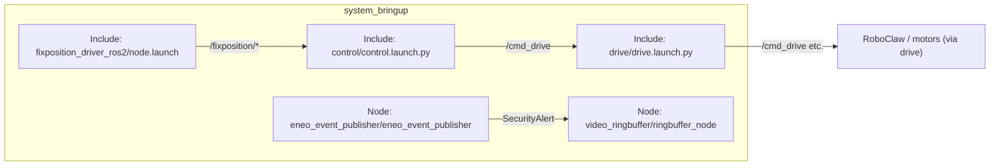

# `system_bringup`

System launch orchestrator package for bringing up the robot’s core ROS 2 stack.

This package intentionally contains **no nodes**. It provides a single entry-point launch file that:

- Includes lower-level package launches (drive + control)
- Starts the Fixposition GNSS/INS driver
- Starts the video ringbuffer (event clip capture)
- Starts the Eneo UDP event publisher (security alerts)

## Package overview

- **Role in the system**: “one command to start the robot”
- **ROS 2 type**: `ament_cmake` (launch-only package)
- **Primary entrypoint**: `launch/controller.launch.py`

## Architecture



## Dependencies

### Runtime (launch)

- **ROS 2 launch**: `launch`, `launch_ros`, `ament_index_python`
- **Packages started by bringup**:
  - `drive` (includes `robot_controller` + `roboclaw_wrapper`)
  - `control` (includes joystick + follower + scheduler + viz nodes; optional Nav2 components)
  - `fixposition_driver_ros2`
  - `video_ringbuffer`
  - `eneo_event_publisher`

### Nav2

`control.launch.py` always starts Nav2 nodes. This requires the relevant Nav2 packages to be installed (e.g. `nav2_controller`, `nav2_lifecycle_manager`). The waypoint follower (Nav2 vs linear) is selected dynamically based on the obstacle avoidance setting in the web UI.

## Launch files

### `controller.launch.py` (main entrypoint)

Starts:

- **Drive**: includes `drive/launch/drive.launch.py`
- **Control**: includes `control/launch/control.launch.py` (with forwarded args)
- **Fixposition**: includes `fixposition_driver_ros2/launch/node.launch` (XML launch)
- **Video ringbuffer**: runs `video_ringbuffer` executable `ringbuffer_node`
- **Eneo event publisher**: runs `eneo_event_publisher` executable `eneo_event_publisher`

#### Launch arguments

- **`log_level`** (default: `info`): forwarded into `control.launch.py`

Example:

```bash
ros2 launch system_bringup controller.launch.py log_level:=debug
```

## Configuration

`system_bringup` itself does not ship a parameter file. Configuration lives in the individual packages:

- **Drive**: `drive/config/params.yaml` (loaded by `drive.launch.py`)
- **Control**: `control/config/params.yaml` (used by multiple nodes in `control.launch.py`)
- **Fixposition**: `fixposition_driver_ros2/launch/config.yaml` (selected via `node.launch` arg `config`, default `config.yaml`)
- **Video ringbuffer**: parameters are currently not set in bringup (see `controller.launch.py` comments)
- **Eneo event publisher**: parameters are currently not set in bringup (see `controller.launch.py` comments)

If you need to configure `video_ringbuffer` or `eneo_event_publisher`, the intended workflow is to add a YAML file (or inline parameters) in `controller.launch.py` and pass it to the `Node(..., parameters=[...])` stanza.

## Build & install

From the ROS 2 workspace root (`ros2_ws/`):

```bash
colcon build --symlink-install
source install/setup.bash
```

To build only bringup:

```bash
colcon build --symlink-install --packages-select system_bringup
source install/setup.bash
```

## Usage

Start the full stack:

```bash
ros2 launch system_bringup controller.launch.py
```

Verify what started:

```bash
ros2 node list
ros2 topic list
```

## Startup order and expectations

`controller.launch.py` launches everything “at once”, but operationally:

- `drive` must be up to accept `/cmd_drive` (or equivalent) commands
- `control` produces command outputs (and may depend on Fixposition topics for some modes)
- `fixposition_driver_ros2` respawns on failure (see `node.launch`)

## Troubleshooting

- **Launch fails: “package not found”**: make sure you sourced the correct overlay: `source install/setup.bash`.
- **Fixposition node repeatedly respawns**: verify device permissions and the Fixposition config file selected by `fixposition_driver_ros2/launch/node.launch`.
- **No motion / motors stopped**:
  - Check the drive hardware connection (RoboClaw device path in `drive/config/params.yaml`)
  - Check command timeouts (`velocity_timeout`) and that `/cmd_drive` is being published
- **Nav2 doesn’t start**:
  - Ensure Nav2 packages are installed
  - Check logs: `log_level:=debug`

## Development notes

- `system_bringup` is the right place to add:
  - Additional “top-level” launch arguments (e.g. enable/disable subsystems)
  - Parameter-file wiring for nodes started directly here (ringbuffer, Eneo)
  - Namespacing and remapping for multi-robot setups

