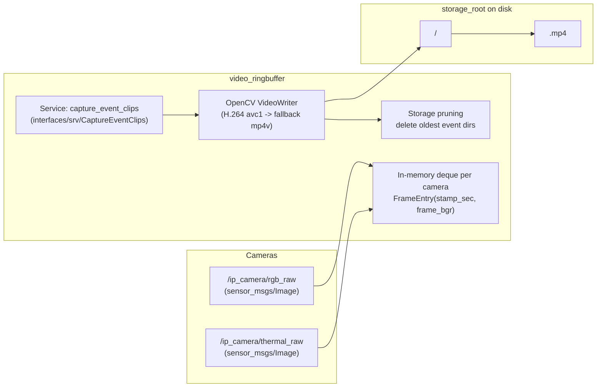

## `video_ringbuffer`

ROS 2 package that **keeps a per-camera in-memory ringbuffer of image frames** and, on request, **writes MP4 clips to disk** for security events (pre/post event window).

This is primarily used by:

- **`eneo_event_publisher`**: publishes `interfaces/msg/SecurityAlert` including camera IDs to record.
- **`robot_web_interface`**: calls the `capture_event_clips` service and serves the resulting clips/metadata to the web UI.
- **`system_bringup`**: launches the ringbuffer node as part of the full stack.

### Architecture



### What gets recorded (camera IDs)

Only camera IDs listed in `video_ringbuffer/camera_config.py` are allowed to be captured:

- `eneo_rgb`
- `eneo_thermal`

Even if a caller requests other IDs, they will be filtered out.

### Node

- **Executable**: `ringbuffer_node`
- **Node name**: `video_ringbuffer`
- **Executor**: `MultiThreadedExecutor(num_threads=4)` (service + image callbacks can run concurrently)

### Interfaces

#### Subscribed topics

The node subscribes to these image topics (currently hard-coded):

- **`/ip_camera/rgb_raw`** (`sensor_msgs/msg/Image`)
- **`/ip_camera/thermal_raw`** (`sensor_msgs/msg/Image`)

Notes:

- The node converts frames via `cv_bridge` using `desired_encoding='bgr8'`.
- Subscription QoS is **BEST_EFFORT**, **depth=1** (no ROS-side buffering; the ringbuffer is internal).
- Frames are **throttled** before buffering to the configured per-camera `frame_rate` (defaults to 10 FPS).

#### Services

##### `capture_event_clips` (`interfaces/srv/CaptureEventClips`)

Request fields:

- **`event_id`**: directory name under `storage_root` (if empty, a timestamp-based ID is generated)
- **`event_time`**: event timestamp (if zero, the node uses “now”)
- **`camera_ids`**: list of camera IDs to capture (if empty, captures all configured cameras, then filters to allowed IDs)
- **`pre_event_seconds`**, **`post_event_seconds`**: override window (if \(\le 0\), node defaults are used)

Response fields:

- **`success`**, **`message`**
- **`file_paths`**: absolute paths to created clips
- **`camera_ids_out`**: camera IDs corresponding 1:1 with `file_paths`

### Output layout on disk

For each capture request, the node writes:

```text
<storage_root>/
  <event_id>/
    eneo_rgb.mp4
    eneo_thermal.mp4
```

After writing, it enforces `max_total_size_mb` by deleting **oldest event directories** (by mtime) until the limit is met.

### Configuration (ROS parameters)

All parameters are on the `video_ringbuffer` node.

- **`storage_root`** (string, default: `/app/ros2_ws/data/security_events`): output directory for event folders.
  - **Important**: `robot_web_interface` currently assumes this same directory (see `robot_web_interface/services/event_repository.py`).
- **`max_total_size_mb`** (float, default: `20480.0`): maximum total disk usage before pruning oldest events.
- **`pre_event_seconds`** (float, default: `60.0`): seconds before event to include.
- **`post_event_seconds`** (float, default: `10.0`): seconds after event to include.
- **`max_buffer_memory_mb`** (float, default: `2048.0`): soft/hard limit for in-memory frame buffers across all cameras.
- **`max_frames_per_camera`** (int, default: `700`): hard per-camera cap (frame-count based).

### Build & install

From your ROS 2 workspace root (`ros2_ws/`):

```bash
colcon build --packages-select video_ringbuffer
source install/setup.bash
```

### Usage

#### Run the node directly

```bash
ros2 run video_ringbuffer ringbuffer_node
```

Override parameters:

```bash
ros2 run video_ringbuffer ringbuffer_node --ros-args \
  -p storage_root:=/app/ros2_ws/data/security_events \
  -p pre_event_seconds:=60.0 \
  -p post_event_seconds:=10.0 \
  -p max_buffer_memory_mb:=2048.0
```

#### Run as part of full system bringup

```bash
ros2 launch system_bringup controller.launch.py
```

### Manual test (service call)

This captures clips around “now” into `.../test_event_001/`.

```bash
ros2 service call /capture_event_clips interfaces/srv/CaptureEventClips "{
  event_id: 'test_event_001',
  event_time: {sec: 0, nanosec: 0},
  camera_ids: ['eneo_rgb', 'eneo_thermal'],
  pre_event_seconds: 5.0,
  post_event_seconds: 3.0
}"
```

### Development notes

#### Where to change camera topics / FPS

The default camera list is currently defined in `video_ringbuffer/ringbuffer_node.py` as `DEFAULT_CAMERAS`:

- camera ID (`camera_id`)
- topic (`topic`)
- frame rate (`frame_rate`)

If you add a new camera intended for event capture, also update `EVENT_RECORDING_CAMERA_IDS` in `video_ringbuffer/camera_config.py` (otherwise captures will be filtered out).

### Troubleshooting

- **Clips are empty / “buffer is empty (no frames received)”**:
  - Ensure your camera publishers are actually publishing to `/ip_camera/rgb_raw` and `/ip_camera/thermal_raw`.
  - Check logs for `First frame received for camera ...` and the per-minute offline warnings.

- **Missing pre-event frames**:
  - The node can only capture what is still in RAM; increase `pre_event_seconds`, `max_frames_per_camera`, and/or `max_buffer_memory_mb`.
  - If memory pressure is high, the node will proactively drop oldest frames.

- **Missing post-event frames**:
  - The service waits briefly for post-event frames (bounded), but if the camera stream is delayed/offline it will capture what’s available.

- **Wrong time window (clip doesn’t correspond to the alert time)**:
  - The node timestamps frames using `msg.header.stamp` if set, otherwise `time.time()`.
  - Make sure the event time you pass in (`event_time`) uses the same time base as the image timestamps.

- **“H.264 codec not available … falling back to mp4v”**:
  - This is expected on some builds of OpenCV. Browser compatibility may be better with H.264; if you need it, ensure your OpenCV/FFmpeg build supports `avc1`.

